# Proxmox Homelab: Complete Setup, Hardening & Monitoring Guide

> A comprehensive guide for deploying Proxmox on repurposed laptop hardware with production-grade monitoring, security hardening, and automated alerting.

## 📋 Table of Contents

- [Overview](#overview)
- [Hardware Requirements](#hardware-requirements)
- [Installation](#installation)
- [Power & Thermal Management](#power--thermal-management)
- [Network Configuration](#network-configuration)
- [Monitoring Stack](#monitoring-stack)
- [Security Hardening](#security-hardening)
- [Backup Strategy](#backup-strategy)
- [Docker Environment](#docker-environment)
- [Alerting System](#alerting-system)
- [Troubleshooting](#troubleshooting)

---

## 🎯 Alert Testing

You can test your alerting pipeline by temporarily stopping a monitored service:

```bash
# Stop node-exporter to trigger an InstanceDown alert
systemctl stop prometheus-node-exporter

# Wait 1-2 minutes for alert to fire
# Check Alertmanager: http://<VM_IP>:9093

# Restart the service
systemctl start prometheus-node-exporter
```

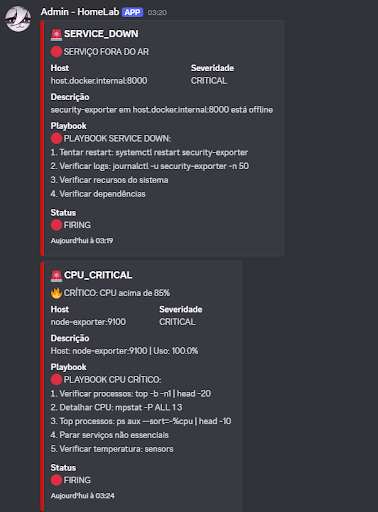

---

## 🎯 Overview

This guide demonstrates how to transform an old laptop into a fully functional Proxmox homelab with:

- **Automated monitoring** via Prometheus, Grafana, and cAdvisor
- **Security hardening** with UFW and Fail2Ban
- **Thermal management** to prevent hardware damage
- **Discord integration** for real-time alerts
- **Containerized workloads** using Docker and Portainer

**Architecture:**
```
Proxmox Host (Laptop)
├─ Node Exporter (host metrics)
├─ VM 100: docker-host
│   ├─ Portainer (container management)
│   ├─ Prometheus (metrics collection)
│   ├─ cAdvisor (container metrics)
│   ├─ Grafana (visualization)
│   └─ Alertmanager (notifications)
└─ VM 101: [Future] Attack/Lab environment
```

---

## 💻 Hardware Requirements

- **Host:** Repurposed laptop (any model with x86_64 CPU)
- **RAM:** 8GB minimum (16GB recommended)
- **Storage:** 128GB+ SSD/HDD
- **Network:** Ethernet connection recommended

---

## 🚀 Installation

### 1. Proxmox VE Installation

1. Download the latest Proxmox VE ISO from [proxmox.com](https://www.proxmox.com)
2. Create bootable USB using Rufus/Etcher
3. Boot from USB and follow installation wizard
4. Set static IP and configure network during setup

---

## ⚡ Power & Thermal Management

### Prevent Laptop Sleep When Lid Closes

```bash
systemctl mask sleep.target suspend.target hibernate.target hybrid-sleep.target
```

### Configure CPU Power Saving

```bash
# Set CPU governor to powersave mode
for c in /sys/devices/system/cpu/cpu*/cpufreq/scaling_governor; do
  echo powersave > $c
done
```

### Disable CPU Turbo Boost

Prevents thermal throttling and extends hardware lifespan:

```bash
echo 1 > /sys/devices/system/cpu/intel_pstate/no_turbo
```

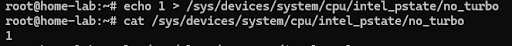

### Automated Thermal Monitoring

1. **Install required packages:**
   ```bash
   apt install lm-sensors mailutils -y
   ```

2. **Detect hardware sensors:**
   ```bash
   sensors-detect
   # Answer YES to all prompts
   ```

   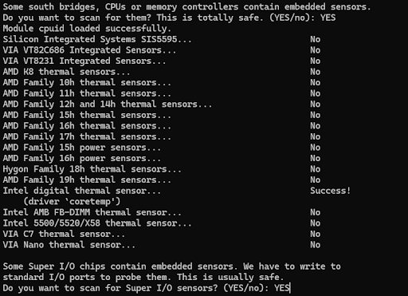

3. **Create temperature alert script:**
   ```bash
   nano /usr/local/bin/temp-alert.sh
   ```
   
   ```bash
   #!/bin/bash
   TEMP=$(sensors | awk '/Package id 0/ {gsub("+|°C","",$4); print int($4)}')
   LIMIT=80

   if [ "$TEMP" -ge "$LIMIT" ]; then
     echo "⚠️ ALERT: CPU at ${TEMP}°C on Proxmox $(hostname)" \
     | mail -s "🔥 THERMAL ALERT PROXMOX" root
   fi
   ```

4. **Schedule automated checks:**
   ```bash
   chmod +x /usr/local/bin/temp-alert.sh
   crontab -e
   ```
   
   Add this line:
   ```
   */5 * * * * /usr/local/bin/temp-alert.sh
   ```

   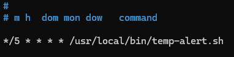

### Dynamic Power Profiles

Create day/night power profiles to balance performance and efficiency:

**Day Mode (Moderate Performance):**
```bash
nano /usr/local/bin/day-mode.sh
```
```bash
#!/bin/bash
for c in /sys/devices/system/cpu/cpu*/cpufreq/scaling_governor; do
  echo schedutil > $c
done
```

**Night Mode (Power Saving):**
```bash
nano /usr/local/bin/night-mode.sh
```
```bash
#!/bin/bash
for c in /sys/devices/system/cpu/cpu*/cpufreq/scaling_governor; do
  echo powersave > $c
done
```

**Schedule automatic switching:**
```bash
chmod +x /usr/local/bin/{day,night}-mode.sh
crontab -e
```
```
0 7 * * * /usr/local/bin/day-mode.sh    # 7 AM - Day mode
0 22 * * * /usr/local/bin/night-mode.sh  # 10 PM - Night mode
```

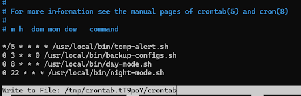

---

## 🌐 Network Configuration

### Configure DNS Resolvers

```bash
nano /etc/resolv.conf
```

Add secure DNS providers:
```
nameserver 9.9.9.9       # Quad9
nameserver 1.1.1.1       # Cloudflare
nameserver 1.0.0.1       # Cloudflare secondary
```

### Update APT Sources

```bash
nano /etc/apt/sources.list
```

Add Debian repositories:
```bash
# Debian official repositories
deb http://deb.debian.org/debian stable main contrib non-free
deb-src http://deb.debian.org/debian stable main contrib non-free

# Debian security updates
deb http://security.debian.org/debian-security stable-security main contrib non-free
```

**Apply updates:**
```bash
apt update && apt upgrade -y
```

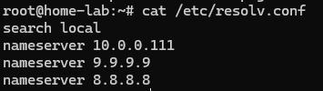

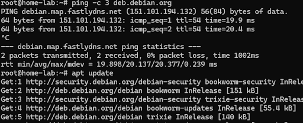

---

## 🔒 Security Hardening

### SSH Configuration

1. **Disable root login and password authentication:**
   ```bash
   nano /etc/ssh/sshd_config
   ```
   
   Modify these lines:
   ```
   PermitRootLogin prohibit-password
   PasswordAuthentication no
   ```

   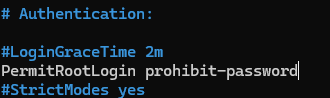

   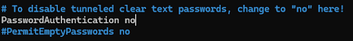

2. **Restart SSH service:**
   ```bash
   systemctl restart ssh
   ```

### Firewall Setup (UFW)

```bash
apt install ufw -y

# Set default policies
ufw default deny incoming
ufw default allow outgoing

# Allow required services
ufw allow ssh
ufw allow 8006/tcp  # Proxmox Web UI

# Enable firewall
ufw enable
ufw status verbose
```

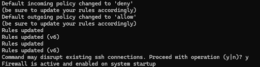

### Fail2Ban Configuration

```bash
apt install fail2ban -y
systemctl enable --now fail2ban

# Verify status
fail2ban-client status
```

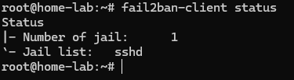

---

## 💾 Backup Strategy

### Automated Configuration Backups

1. **Create backup directory:**
   ```bash
   mkdir -p /backup/configs
   ```

2. **Create backup script:**
   ```bash
   nano /usr/local/bin/backup-configs.sh
   ```
   
   ```bash
   #!/bin/bash
   tar czf /backup/configs/proxmox-configs-$(date +%F).tar.gz \
   /etc/pve /etc/network /etc/ssh
   ```

3. **Schedule weekly backups:**
   ```bash
   chmod +x /usr/local/bin/backup-configs.sh
   crontab -e
   ```
   
   Add:
   ```
   0 3 * * 0 /usr/local/bin/backup-configs.sh  # Every Sunday at 3 AM
   ```

---

## 🐋 Docker Environment

### Create Docker VM

**VM Specifications:**
- **ID:** 100
- **CPU:** 2 cores, 1 socket, host CPU type
- **RAM:** 4GB (ballooning enabled)
- **Disk:** 40GB
- **BIOS:** SeaBIOS
- **Machine:** q35
- **OS:** Debian 12 (minimal)

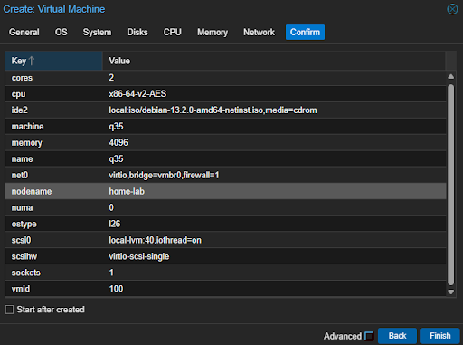

### Install Docker

```bash
# Update system
apt update && apt upgrade -y
apt install ca-certificates curl gnupg htop -y

# Install Docker
curl -fsSL https://get.docker.com | sh

# Install Docker Compose plugin
apt install docker-compose-plugin -y
docker compose version
```

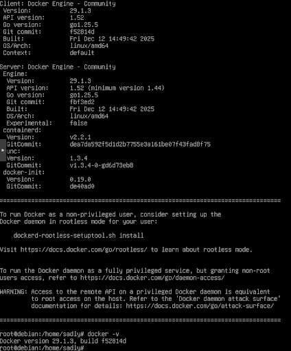

### Optimize Docker Logging

```bash
nano /etc/docker/daemon.json
```

```json
{
  "log-driver": "json-file",
  "log-opts": {
    "max-size": "5m",
    "max-file": "2"
  },
  "storage-driver": "overlay2"
}
```

Apply changes:
```bash
systemctl restart docker
```

### Deploy Portainer

```bash
mkdir -p ~/stacks/base
cd ~/stacks/base
nano docker-compose.yml
```

```yaml
version: "3.9"

services:
  portainer:
    image: portainer/portainer-ce:latest
    container_name: portainer
    restart: unless-stopped
    ports:
      - "9000:9000"
    volumes:
      - /var/run/docker.sock:/var/run/docker.sock
      - portainer_data:/data
    deploy:
      resources:
        limits:
          cpus: "0.75"
          memory: 384M

  node-exporter:
    image: prom/node-exporter:latest
    container_name: node-exporter
    restart: unless-stopped
    ports:
      - "9100:9100"
    deploy:
      resources:
        limits:
          cpus: "0.25"
          memory: 64M

volumes:
  portainer_data:
```

Deploy:
```bash
docker compose up -d
```

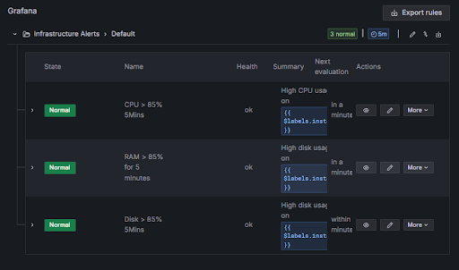

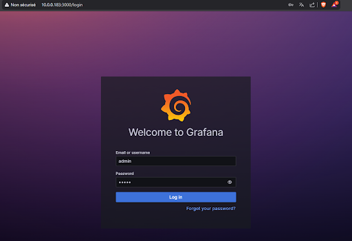

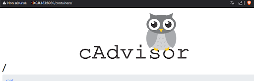

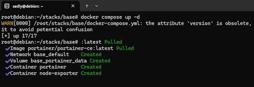

Access Portainer: `http://<VM_IP>:9000`

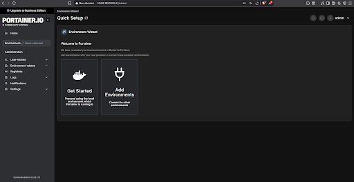

---

## 📊 Monitoring Stack

### Architecture Overview

```
Proxmox Host
├─ Node Exporter (port 9100) → Host metrics
└─ Docker VM
    ├─ cAdvisor (port 8080) → Container metrics
    ├─ Prometheus (port 9090) → Metrics aggregation
    ├─ Grafana (port 3000) → Visualization
    └─ Alertmanager (port 9093) → Alert routing
```

### Install Node Exporter (Proxmox Host)

```bash
apt install prometheus-node-exporter -y
systemctl status prometheus-node-exporter
```

### Deploy cAdvisor

```bash
mkdir -p /opt/monitoring/cadvisor
cd /opt/monitoring/cadvisor
nano docker-compose.yml
```

```yaml
version: "3.8"

services:
  cadvisor:
    image: gcr.io/cadvisor/cadvisor:v0.49.1
    container_name: cadvisor
    restart: unless-stopped
    ports:
      - "8080:8080"
    volumes:
      - /:/rootfs:ro
      - /var/run:/var/run:ro
      - /sys:/sys:ro
      - /var/lib/docker/:/var/lib/docker:ro
    deploy:
      resources:
        limits:
          cpus: "0.50"
          memory: 256M
```

```bash
docker compose up -d
```

### Deploy Prometheus

```bash
mkdir -p /opt/monitoring/prometheus/{data,config}
cd /opt/monitoring/prometheus
```

**Create configuration:**
```bash
nano config/prometheus.yml
```

```yaml
global:
  scrape_interval: 15s
  evaluation_interval: 15s

scrape_configs:
  - job_name: "node"
    static_configs:
      - targets: ["<PROXMOX_HOST_IP>:9100"]

  - job_name: "cadvisor"
    static_configs:
      - targets: ["localhost:8080"]

rule_files:
  - "alert.rules.yml"

alerting:
  alertmanagers:
    - static_configs:
        - targets:
          - "alertmanager:9093"
```

**Create alert rules:**
```bash
nano config/alert.rules.yml
```

```yaml
groups:
- name: infrastructure-alerts
  rules:
  - alert: HighCPUUsage
    expr: 100 - (avg by(instance)(irate(node_cpu_seconds_total{mode="idle"}[5m])) * 100) > 85
    for: 5m
    labels:
      severity: warning
    annotations:
      summary: "High CPU usage on {{ $labels.instance }}"
      description: "CPU usage is at {{ $value | humanize }}% for 5 minutes"

  - alert: HighMemoryUsage
    expr: (node_memory_MemTotal_bytes - node_memory_MemAvailable_bytes) / node_memory_MemTotal_bytes * 100 > 85
    for: 5m
    labels:
      severity: warning
    annotations:
      summary: "High memory usage on {{ $labels.instance }}"
      description: "Memory usage is at {{ $value | humanize }}%"

  - alert: HighDiskUsage
    expr: (node_filesystem_size_bytes - node_filesystem_avail_bytes) / node_filesystem_size_bytes * 100 > 85
    for: 5m
    labels:
      severity: warning
    annotations:
      summary: "High disk usage on {{ $labels.instance }}"
      description: "Disk usage is at {{ $value | humanize }}%"

  - alert: InstanceDown
    expr: up == 0
    for: 1m
    labels:
      severity: critical
    annotations:
      summary: "Instance down: {{ $labels.instance }}"
      description: "Target {{ $labels.instance }} is offline!"
```

**Create Docker Compose:**
```bash
nano docker-compose.yml
```

```yaml
version: "3.8"

services:
  prometheus:
    image: prom/prometheus:v2.52.0
    container_name: prometheus
    restart: unless-stopped
    ports:
      - "9090:9090"
    volumes:
      - ./config/prometheus.yml:/etc/prometheus/prometheus.yml:ro
      - ./config/alert.rules.yml:/etc/prometheus/alert.rules.yml:ro
      - ./data:/prometheus
    command:
      - "--config.file=/etc/prometheus/prometheus.yml"
      - "--storage.tsdb.retention.time=7d"
      - "--storage.tsdb.retention.size=1GB"
    deploy:
      resources:
        limits:
          cpus: "1.0"
          memory: 512M
```

```bash
docker compose up -d
```

### Deploy Grafana

```bash
mkdir -p /opt/monitoring/grafana/data
cd /opt/monitoring/grafana
nano docker-compose.yml
```

```yaml
version: "3.8"

services:
  grafana:
    image: grafana/grafana:10.4.3
    container_name: grafana
    restart: unless-stopped
    ports:
      - "3000:3000"
    volumes:
      - ./data:/var/lib/grafana
    environment:
      - GF_SECURITY_ADMIN_USER=admin
      - GF_SECURITY_ADMIN_PASSWORD=ChangeMe123!
      - GF_USERS_ALLOW_SIGN_UP=false
    deploy:
      resources:
        limits:
          cpus: "0.50"
          memory: 256M
```

```bash
docker compose up -d
```

Access Grafana: `http://<VM_IP>:3000`

**Configure Grafana:**

1. **Add Prometheus data source:**
   - Navigate to: Connections → Data Sources → Add data source → Prometheus
   - URL: `http://prometheus:9090`
   - Click "Save & Test"

2. **Import pre-built dashboards:**
   - Home > Dashboards > Import dashboard
   - **Node Exporter Full:** Dashboard ID `1860`
   - **Docker cAdvisor:** Dashboard ID `14282`

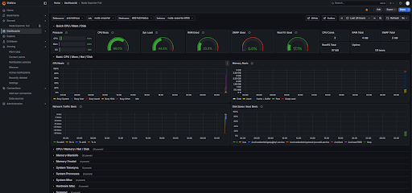

### Useful Prometheus Queries

```promql
# Host CPU usage
100 - (avg by(instance)(irate(node_cpu_seconds_total{mode="idle"}[5m])) * 100)

# Host memory usage
(node_memory_MemTotal_bytes - node_memory_MemAvailable_bytes) / node_memory_MemTotal_bytes * 100

# Container CPU usage
rate(container_cpu_usage_seconds_total[5m]) * 100

# Disk usage
(node_filesystem_size_bytes - node_filesystem_avail_bytes) / node_filesystem_size_bytes * 100
```

---

## 🔔 Alerting System

### Deploy Alertmanager

```bash
mkdir -p /opt/monitoring/alertmanager
cd /opt/monitoring/alertmanager
nano alertmanager.yml
```

```yaml
global:
  resolve_timeout: 5m

route:
  receiver: 'discord-notifications'
  group_wait: 10s
  group_interval: 30s
  repeat_interval: 4h

receivers:
  - name: 'discord-notifications'
    webhook_configs:
      - url: 'https://discord.com/api/webhooks/<WEBHOOK_ID>/<WEBHOOK_TOKEN>'
        send_resolved: true
```

**Create Docker Compose:**
```bash
nano docker-compose.yml
```

```yaml
version: "3.8"

services:
  alertmanager:
    image: prom/alertmanager:latest
    container_name: alertmanager
    restart: unless-stopped
    ports:
      - "9093:9093"
    volumes:
      - ./alertmanager.yml:/etc/alertmanager/alertmanager.yml:ro
    command:
      - '--config.file=/etc/alertmanager/alertmanager.yml'
    deploy:
      resources:
        limits:
          cpus: "0.25"
          memory: 128M
```

```bash
docker compose up -d
```

### Configure Discord Webhook

1. Go to your Discord server settings
2. Navigate to: Integrations → Webhooks → New Webhook
3. Copy the webhook URL
4. Replace in `alertmanager.yml` configuration

**Alert notification format:**
```
🚨 **HOMELAB ALERT** 🚨

**Status:** {{ .Status }}
**Alert:** {{ .Annotations.summary }}
**Description:** {{ .Annotations.description }}
**Value:** {{ .Values.A }}
**Instance:** {{ .Labels.instance }}
**Started:** {{ .StartsAt.Format "2006-01-02 15:04:05" }}
```

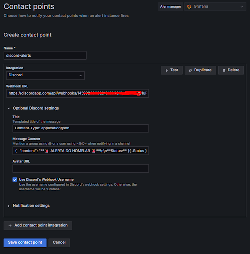

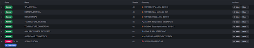

---

## 📈 Resource Usage

**Average resource consumption:**

| Component | RAM | CPU (idle) |
|-----------|-----|------------|
| Prometheus | ~150MB | <2% |
| Grafana | ~120MB | <2% |
| cAdvisor | ~80MB | <1% |
| Alertmanager | ~40MB | <1% |
| Node Exporter | ~20MB | <1% |
| **Total** | **~700MB** | **<5%** |

---

## 🔧 Troubleshooting

### Common Issues

**Docker containers not starting:**
```bash
docker compose logs -f
docker system prune -a  # Clean up if disk is full
```

**Prometheus not scraping targets:**
```bash
# Check Prometheus targets status
curl http://localhost:9090/api/v1/targets

# Verify firewall allows communication
ufw status verbose
```

**Alerts not triggering:**
```bash
# Check Alertmanager status
docker logs alertmanager

# Verify Prometheus alert rules
curl http://localhost:9090/api/v1/rules
```

**High CPU temperature:**
```bash
# Check current temperature
sensors

# Verify thermal management scripts
systemctl status prometheus-node-exporter
crontab -l | grep temp-alert
```

---

## 📚 Additional Resources

- [Proxmox VE Documentation](https://pve.proxmox.com/wiki/Main_Page)
- [Prometheus Documentation](https://prometheus.io/docs/)
- [Grafana Documentation](https://grafana.com/docs/)
- [Docker Documentation](https://docs.docker.com/)

---

## 📝 License

This guide is provided as-is for educational purposes. Adapt configurations to your specific environment and security requirements.

---

**Last Updated:** January 2026
