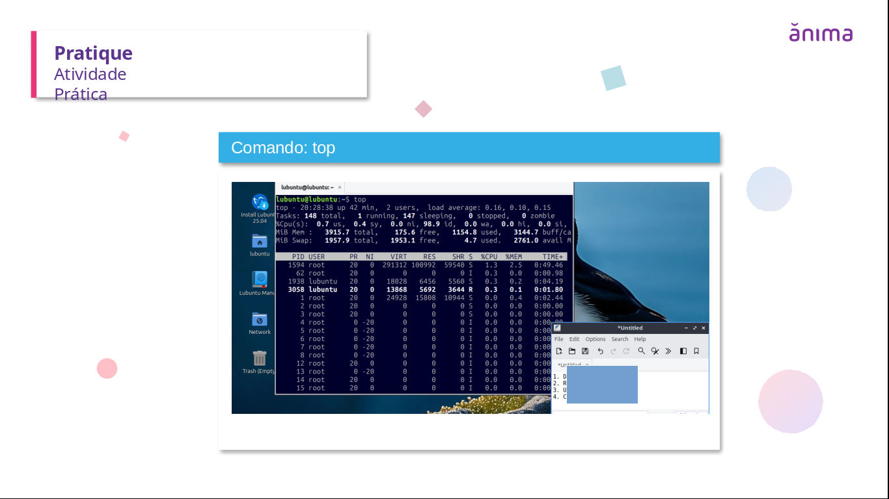

# Linux System Basics – Virtualized Environment

This lab is based on an academic practical activity from my cybersecurity degree.
The objective was to install a Linux operating system in a virtualized environment
and analyze system and resource information using native Linux commands.

These concepts are fundamental for security operations, system monitoring
and incident analysis in SOC environments.
